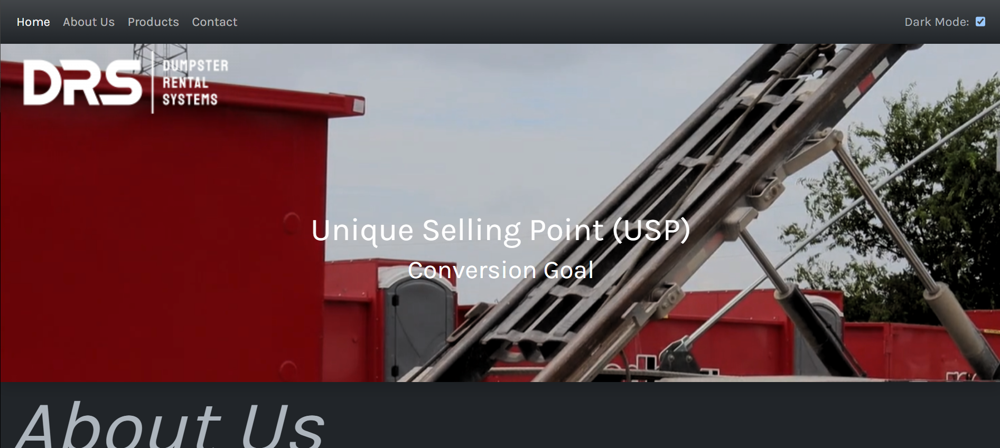

# DRS Assessment  
    

## TABLE OF CONTENTS:

* [Description](#description)  
* [Usage Info](#usage)  
* [Questions](#questions)  
* [Credits](#credit)  
* [License](#license)  

## DESCRIPTION:

This is the ReadMe for Matthew Lawhorn's project titled: DRS Assessment  
This is an assessment of my front-end web dev capabilities using only JavaScript, CSS/HTML, Bootstrap and jQuery.  
  

## USAGE:

This site is deployed on GitHub pages, [click here](https://lawhornmatt.github.io/SysRenDum-Vanilla/) to check it out.

## QUESTIONS:

If you have any questions,  
you can find my GitHub here: https://github.com/Lawhornmatt

## CREDIT:

This project was made in 2023 by Matthew Lawhorn

## LICENSE:

This program is copyrighted under the MIT open source license.

Copyright 2023 Matthew Lawhorn

    Permission is hereby granted, free of charge, to any person obtaining a copy of this software and associated documentation files (the "Software"), to deal in the Software without restriction, including without limitation the rights to use, copy, modify, merge, publish, distribute, sublicense, and/or sell copies of the Software, and to permit persons to whom the Software is furnished to do so, subject to the following conditions:
    
    The above copyright notice and this permission notice shall be included in all copies or substantial portions of the Software.
    
    THE SOFTWARE IS PROVIDED "AS IS", WITHOUT WARRANTY OF ANY KIND, EXPRESS OR IMPLIED, INCLUDING BUT NOT LIMITED TO THE WARRANTIES OF MERCHANTABILITY, FITNESS FOR A PARTICULAR PURPOSE AND NONINFRINGEMENT. IN NO EVENT SHALL THE AUTHORS OR COPYRIGHT HOLDERS BE LIABLE FOR ANY CLAIM, DAMAGES OR OTHER LIABILITY, WHETHER IN AN ACTION OF CONTRACT, TORT OR OTHERWISE, ARISING FROM, OUT OF OR IN CONNECTION WITH THE SOFTWARE OR THE USE OR OTHER DEALINGS IN THE SOFTWARE.

[Further license information can be found here.](https://opensource.org/licenses/MIT)  
-- --  
This ReadMe was generated by my [BoilerMaker project](https://github.com/Lawhornmatt/BoilerMaker)  
